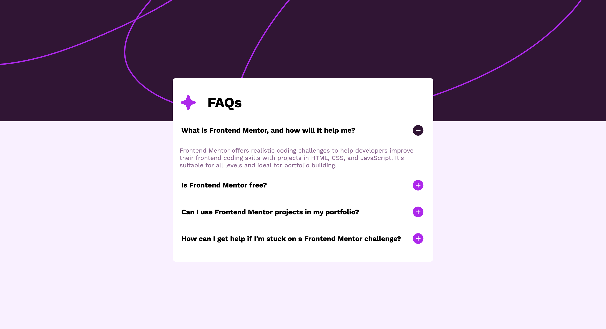

# 01-FAQ-Accordion

FAQ Accordion with JavaScript

What I learned:

- using button instead of <a> is more semantically correct. to get rid of button styling just put background and border to none and cursor to pointer.
- practice with javascript
- used the closest method
- learned that its best to not use global variables

